<!-- <h3><code>souvik@github ~ $ ./contributions.sh</code></h3> -->

  

<!-- <h3><code>souvik@github ~ $ whoami</code></h3> -->

  Full Stack Developer · Extension Developer · Cybersecurity Enthusiast

  I build web applications, browser extensions, and developer-focused tools.
  Interested in security, automation, and building things that are actually useful.

<table>
  <tr>
    <td valign="top">
      
    </td>
    <td valign="top">
      
    </td>
  </tr>
</table>

